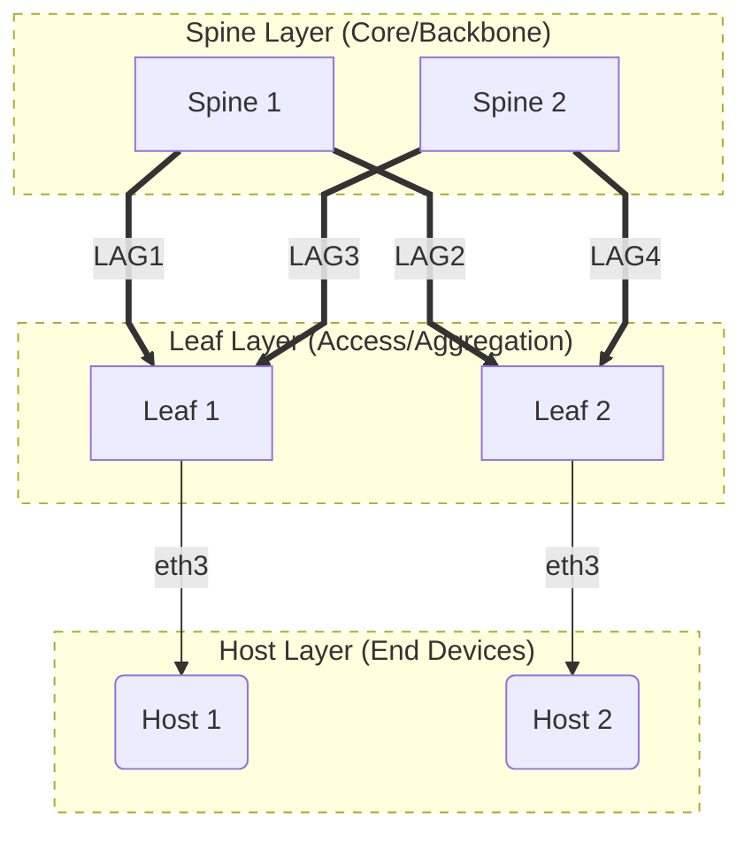

# SONiC Spine-Leaf Lab

## Overview

This lab demonstrates a **fully functional traditional spine-leaf network architecture** using real SONiC (Software for Open Networking in the Cloud) network operating system images. The lab showcases enterprise-grade network design patterns commonly used in modern data centers.

## Architecture




**Key Features:**
- **X Cross-Connectivity**: Each leaf connects to both spines for redundancy
- **LAG Bundling**: 2x links per connection for increased bandwidth
- **Redundant Paths**: Leaf1 ↔ Leaf2 can route via Spine1 OR Spine2
- **Load Balancing**: Traffic can be distributed across both spine switches
- **High Availability**: No single point of failure in the spine layer

## Network Topology

### Spine Switches (2x for redundancy)
- **Spine1**: 10.0.1.1 (mgmt), 10.1.1.1/30 (eth1), 10.1.2.1/30 (eth2)
- **Spine2**: 10.0.1.2 (mgmt), 10.1.3.1/30 (eth1), 10.1.4.1/30 (eth2)

### Leaf Switches (2x for access layer)
- **Leaf1**: 10.0.2.1 (mgmt), 10.1.1.2/30 (eth1), 10.1.3.2/30 (eth2), 10.2.1.1/24 (eth3)
- **Leaf2**: 10.0.2.2 (mgmt), 10.1.2.2/30 (eth1), 10.1.4.2/30 (eth2), 10.2.2.1/24 (eth3)

### Host Connections
- **Host1**: 10.2.1.10/24 (connected to Leaf1:eth3)
- **Host2**: 10.2.2.10/24 (connected to Leaf2:eth3)

## LAG Configuration

**PortChannel Mapping:**
- **PortChannel1**: Spine1 ↔ Leaf1 (Ethernet0 + Ethernet4)
- **PortChannel2**: Spine1 ↔ Leaf2 (Ethernet8 + Ethernet12)  
- **PortChannel3**: Spine2 ↔ Leaf1 (Ethernet0 + Ethernet4)
- **PortChannel4**: Spine2 ↔ Leaf2 (Ethernet8 + Ethernet12)
- **PortChannel5**: Leaf1 internal (Ethernet0 + Ethernet4)
- **PortChannel6**: Leaf1 internal (Ethernet8 + Ethernet12)
- **PortChannel7**: Leaf2 internal (Ethernet0 + Ethernet4)
- **PortChannel8**: Leaf2 internal (Ethernet8 + Ethernet12)

## Quick Start

### Deploy the Lab
```bash
# Deploy the entire lab (Clabernetes + SONiC topology)
make deploy-all LAB=demo-cl-sonic-01
```

### Configure the Network
```bash
# Configure all interfaces and routing
make configure-lab LAB=demo-cl-sonic-01
```

### Test Connectivity
```bash
# Test all network paths
make test-lab LAB=demo-cl-sonic-01
```

### Clean Up
```bash
# Destroy the lab
make destroy-all LAB=demo-cl-sonic-01
```

## Expected Results

### Direct Spine-Leaf Connectivity
- Spine1 ↔ Leaf1 (10.1.1.1 ↔ 10.1.1.2)
- Spine1 ↔ Leaf2 (10.1.2.1 ↔ 10.1.2.2)
- Spine2 ↔ Leaf1 (10.1.3.1 ↔ 10.1.3.2)
- Spine2 ↔ Leaf2 (10.1.4.1 ↔ 10.1.4.2)

### Cross-Leaf Connectivity (via both spines)
- Leaf1 ↔ Leaf2 via Spine1 (10.1.1.2 ↔ 10.1.2.2)
- Leaf1 ↔ Leaf2 via Spine2 (10.1.3.2 ↔ 10.1.4.2)

### LAG Infrastructure
- PortChannel1-8 created with proper member interface assignment
- EthernetX interfaces properly assigned to PortChannelX
- LAG member relationships established

## File Structure

```
labs/demo-cl-sonic-01/
├── README.md              # This documentation
├── topology.yaml          # Containerlab topology definition
├── deploy.sh              # Lab deployment script
├── configure.sh           # Network configuration script (includes LAG setup)
├── test.sh                # Connectivity testing script
├── status.sh              # Lab status and health check
├── destroy.sh             # Lab cleanup script
├── prep.sh                # SONiC image preparation
└── assets/                # SONiC image files
    └── docker-sonic-vs.gz # SONiC container image
```

## Key Implementation Details

### SONiC Image
- **Source**: Microsoft Azure SONiC Branch 202505
- **Registry**: Quay.io (custom registry)
- **Image**: `quay.io/bjozsa-redhat/sonic-vs:202505`
- **Login**: `admin` / `YourPaSsWoRd`

### Network Configuration
- **IP Forwarding**: Enabled on all SONiC switches
- **Static Routes**: Manually configured for predictable routing
- **Interface Management**: Linux `ip` commands for configuration
- **MTU**: 9122 bytes for containerlab links, 1500 for management

---

**Lab Status**: Working spine-leaf deployment using [SONiC Switch OS](https://sonicfoundation.dev/) <br>
**Architecture**: Traditional spine-leaf with LAG cross-connects and redundant connectivity <br>
**SONiC Version**: Branch 202505 (latest stable) <br>
